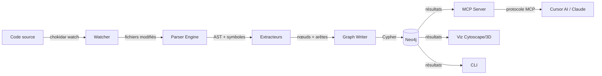

# NOMIK — Architecture & Structure du projet

## Architecture de haut niveau

```
┌──────────────────────────────────────────────────────────────┐
│                      SYSTÈME NOMIK                           │
│                                                              │
│  ┌────────────┐   ┌────────────┐   ┌────────────────────┐   │
│  │   Parser   │──▶│   Graph    │◀──│    MCP Server      │   │
│  │(Tree-sitter│   │  (Neo4j)   │   │ (stdio/SSE/HTTP)   │   │
│  │ + Markdown)│   └─────┬──────┘   └────────▲───────────┘   │
│  └─────▲──────┘         │                    │               │
│        │                 │                    │               │
│  ┌─────┴──────┐   ┌─────▼──────┐   ┌────────┴───────────┐   │
│  │  Watcher   │   │  Viz Web  │   │  Cursor / Claude   │   │
│  │ (chokidar) │   │Cytoscape  │   │  Desktop / CLI     │   │
│  │  debounce  │   │3d-force-  │   └────────────────────┘   │
│  └────────────┘   │  graph    │                            │
│                   └───────────┘                            │
│                                                              │
│  ┌──────────────────────────────────────────────────────┐   │
│  │  CLI  (nomik init/scan/status/impact/watch/serve/     │   │
│  │        query/recent/setup-cursor/project)             │   │
│  └──────────────────────────────────────────────────────┘   │
└──────────────────────────────────────────────────────────────┘
```

## Flux de données



## Structure du monorepo (Turborepo + pnpm)

```
nomik/
├── packages/
│   ├── core/                    # Noyau partagé (types, config, logger)
│   │   ├── src/
│   │   │   ├── types/
│   │   │   │   ├── nodes.ts          # Définitions des types de nœuds
│   │   │   │   ├── edges.ts          # Définitions des types d'arêtes
│   │   │   │   ├── config.ts         # Schéma de configuration
│   │   │   │   └── index.ts          # Ré-exports
│   │   │   ├── config/
│   │   │   │   └── ...               # Chargement, validation (Zod)
│   │   │   ├── logger/
│   │   │   │   └── ...               # Logger structuré (pino)
│   │   │   └── index.ts
│   │   ├── package.json
│   │   └── tsconfig.json
│   │
│   ├── parser/                  # Moteur de parsing Tree-sitter
│   │   ├── src/
│   │   │   ├── languages/
│   │   │   │   ├── typescript.ts     # Grammaire TS/JS + requêtes
│   │   │   │   ├── registry.ts      # Détection automatique de langue
│   │   │   │   └── index.ts
│   │   │   ├── extractors/
│   │   │   │   ├── functions.ts      # Extraction fonctions/méthodes
│   │   │   │   ├── classes.ts        # Extraction classes/interfaces
│   │   │   │   ├── imports.ts        # Extraction imports/require
│   │   │   │   ├── exports.ts        # Extraction exports
│   │   │   │   ├── routes.ts         # Extraction routes HTTP/décorateurs
│   │   │   │   ├── calls.ts          # Résolution appels → définitions
│   │   │   │   ├── python.ts         # Extracteur Python
│   │   │   │   ├── rust.ts           # Extracteur Rust
│   │   │   │   ├── markdown.ts       # Parser custom Markdown
│   │   │   │   └── index.ts          # Orchestrateur des extracteurs
│   │   │   ├── discovery.ts         # Découverte des fichiers
│   │   │   ├── parser.ts             # Orchestrateur principal
│   │   │   └── index.ts
│   │   ├── package.json
│   │   └── tsconfig.json
│   │
│   ├── graph/                   # Couche d'abstraction Neo4j
│   │   ├── src/
│   │   │   ├── drivers/
│   │   │   │   ├── neo4j.driver.ts   # Connexion Neo4j & gestion sessions
│   │   │   │   └── driver.interface.ts # Contrat abstrait du driver
│   │   │   ├── queries/
│   │   │   │   ├── write.ts           # Upsert nœuds/arêtes (projectId),
│   │   │   │   │                      # CRUD projet (create/list/get/delete)
│   │   │   │   └── read.ts            # Impact, dead code, god objects,
│   │   │   │                          # stats, chaîne de dépendances,
│   │   │   │                          # changements récents (tous filtrés projectId)
│   │   │   ├── schema/
│   │   │   │   └── init.ts            # Contraintes + index projectId
│   │   │   ├── cache.ts               # QueryCache TTL 30s
│   │   │   ├── graph.service.ts       # Opérations haut niveau
│   │   │   └── index.ts
│   │   ├── package.json
│   │   └── tsconfig.json
│   │
│   ├── watcher/                 # Surveillance du système de fichiers
│   │   ├── src/
│   │   │   ├── watcher.ts            # chokidar + debounce + projectId
│   │   │   └── index.ts
│   │   ├── package.json
│   │   └── tsconfig.json
│   │
│   ├── mcp-server/              # Serveur protocole MCP
│   │   ├── src/
│   │   │   ├── tools.ts              # 8 outils : kb_search, kb_impact,
│   │   │   │                          # kb_dependency_trace, kb_get_context,
│   │   │   │                          # kb_graph_stats, kb_find_path,
│   │   │   │                          # kb_recent_changes, kb_list_projects
│   │   │   ├── resources.ts           # Ressources MCP
│   │   │   └── index.ts
│   │   ├── package.json
│   │   └── tsconfig.json
│   │
│   ├── viz/                     # Dashboard de visualisation
│   │   ├── src/
│   │   │   ├── components/
│   │   │   │   ├── GraphViewer.tsx    # Graphe 2D Cytoscape.js
│   │   │   │   ├── Graph3DViewer.tsx  # Graphe 3D 3d-force-graph (Three.js)
│   │   │   │   ├── SearchBar.tsx      # Recherche dans le graphe
│   │   │   │   ├── FilterPanel.tsx    # Filtres nœuds/arêtes
│   │   │   │   ├── NodeDetail.tsx     # Panneau inspecteur nœud
│   │   │   │   ├── HelpModal.tsx      # Modal d'aide
│   │   │   │   └── LayoutSelector.tsx # Sélecteur de disposition
│   │   │   ├── styles/
│   │   │   │   ├── graphLayout.ts     # Styles de layout
│   │   │   │   └── graphStyles.ts     # Styles du graphe
│   │   │   ├── neo4j.ts              # Client Neo4j pour la viz
│   │   │   ├── App.tsx
│   │   │   └── main.tsx
│   │   ├── package.json              # React, Vite, TailwindCSS,
│   │   └── tsconfig.json              # cytoscape, 3d-force-graph
│   │
│   └── cli/                     # Interface en ligne de commande
│       ├── src/
│       │   ├── commands/
│       │   │   ├── init.ts            # nomik init — configuration
│       │   │   ├── scan.ts            # nomik scan — parse & index
│       │   │   ├── status.ts          # nomik status — santé du graphe
│       │   │   ├── impact.ts          # nomik impact <fonction>
│       │   │   ├── watch.ts           # nomik watch — mode incrémental
│       │   │   ├── serve.ts           # nomik serve — MCP + Viz
│       │   │   ├── query.ts           # nomik query — requête Cypher
│       │   │   ├── recent.ts          # nomik recent — changements récents
│       │   │   ├── setup-cursor.ts    # nomik setup-cursor
│       │   │   └── project.ts         # nomik project list/create/
│       │   │                          # switch/delete/info
│       │   ├── utils/
│       │   │   └── project-config.ts  # .nomik/project.json
│       │   └── index.ts               # Point d'entrée CLI (commander)
│       ├── package.json
│       └── tsconfig.json
│
├── docker-compose.yml                 # Neo4j Community (racine du repo)
│
├── nomik.config.ts                   # Config projet utilisateur
├── turbo.json                         # Pipeline Turborepo
├── pnpm-workspace.yaml                # Définition workspace pnpm
├── tsconfig.base.json                 # Config TS partagée
├── package.json                       # Package racine
├── LICENSE
└── README.md
```

## Isolation multi-projet

- **`.nomik/project.json`** : stocke le `projectId` courant (projet actif)
- **projectId** : présent sur tous les nœuds et arêtes du graphe
- **projectId** : injecte explicitement dans toutes les requetes et mutations
- Les requêtes de lecture (impact, dead code, stats, etc.) filtrent par `projectId`

## Responsabilités des modules (frontières strictes)

| Module | Responsabilité | Dépend de | Expose |
|--------|----------------|-----------|--------|
| `@nomik/core` | Types, config, logging | Rien | Types, Config, Logger |
| `@nomik/parser` | Code → symboles structurés | `core` | `parseFile()`, `parseProject()` |
| `@nomik/graph` | Stockage & requêtes sur le graphe | `core` | `GraphService`, `createGraphService` |
| `@nomik/watcher` | Détection des changements fichiers | `core`, `parser`, `graph` | `createWatcher()` |
| `@nomik/mcp-server` | Interface protocole MCP pour l'IA | `core`, `graph` | Outils et ressources MCP |
| `@nomik/viz` | Dashboard navigateur | `core` (types uniquement) | Application web |
| `@nomik-ai/cli` | Interface utilisateur CLI | Tous les packages | Binaire CLI |

> [!CAUTION]
> **Pas de dépendances circulaires.** Le graphe de dépendances est strictement unidirectionnel : `core` → `parser`/`graph` → `watcher`/`mcp-server` → `cli`. Le package `viz` est isolé et communique via l'API HTTP (Neo4j direct ou serveur).
