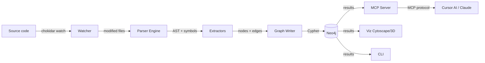

# NOMIK — Architecture & Project Structure

## High-Level Architecture

```
┌──────────────────────────────────────────────────────────────┐
│                      NOMIK SYSTEM                           │
│                                                              │
│  ┌────────────┐   ┌────────────┐   ┌────────────────────┐   │
│  │   Parser   │──▶│   Graph    │◀──│    MCP Server      │   │
│  │(Tree-sitter│   │  (Neo4j)   │   │ (stdio/SSE/HTTP)   │   │
│  │ + Markdown)│   └─────┬──────┘   └────────▲───────────┘   │
│  └─────▲──────┘         │                    │               │
│        │                 │                    │               │
│  ┌─────┴──────┐   ┌─────▼──────┐   ┌────────┴───────────┐   │
│  │  Watcher   │   │  Viz Web  │   │  Cursor / Claude   │   │
│  │ (chokidar) │   │Cytoscape  │   │  Desktop / CLI     │   │
│  │  debounce  │   │3d-force-  │   └────────────────────┘   │
│  └────────────┘   │  graph    │                            │
│                   └───────────┘                            │
│                                                              │
│  ┌──────────────────────────────────────────────────────┐   │
│  │  CLI  (nomik init/scan/status/impact/watch/serve/     │   │
│  │        query/recent/setup-cursor/setup-windsurf/      │   │
│  │        project/pr-impact)                             │   │
│  └──────────────────────────────────────────────────────┘   │
└──────────────────────────────────────────────────────────────┘
```

## Data Flow



## Monorepo Structure (Turborepo + pnpm)

```
nomik/
├── packages/
│   ├── core/                    # Shared core (types, config, logger)
│   │   ├── src/
│   │   │   ├── types/
│   │   │   │   ├── nodes.ts          # Node type definitions
│   │   │   │   ├── edges.ts          # Edge type definitions
│   │   │   │   ├── config.ts         # Configuration schema
│   │   │   │   └── index.ts          # Re-exports
│   │   │   ├── config/
│   │   │   │   └── ...               # Loading, validation (Zod)
│   │   │   ├── logger/
│   │   │   │   └── ...               # Structured logger (pino)
│   │   │   └── index.ts
│   │   ├── package.json
│   │   └── tsconfig.json
│   │
│   ├── parser/                  # Tree-sitter parsing engine
│   │   ├── src/
│   │   │   ├── languages/
│   │   │   │   ├── typescript.ts     # TS/JS grammar + queries
│   │   │   │   ├── registry.ts      # Automatic language detection
│   │   │   │   └── index.ts
│   │   │   ├── extractors/
│   │   │   │   ├── ast-utils.ts      # Shared AST helpers (deduped)
│   │   │   │   ├── functions.ts      # Function/method extraction
│   │   │   │   ├── classes.ts        # Class/interface extraction
│   │   │   │   ├── imports.ts        # Import/require extraction
│   │   │   │   ├── exports.ts        # Export extraction
│   │   │   │   ├── routes.ts         # HTTP route/decorator extraction
│   │   │   │   ├── calls.ts          # Call resolution → definitions
│   │   │   │   ├── api-calls.ts      # API call detection (fetch/axios/ky)
│   │   │   │   ├── db-operations.ts  # DB operation detection (Prisma/Supabase)
│   │   │   │   ├── db-schema/        # DB migration schema extraction (modular)
│   │   │   │   │   ├── types.ts      # Shared types (DBSchemaTable, DBSchemaColumn)
│   │   │   │   │   ├── builder.ts    # Node/edge builder
│   │   │   │   │   ├── sql.ts        # SQL CREATE/ALTER parser
│   │   │   │   │   ├── csharp.ts     # C# EF migration parser
│   │   │   │   │   ├── python.ts     # Django + Alembic migration parser
│   │   │   │   │   └── index.ts      # Barrel re-exports
│   │   │   │   ├── python.ts         # Python extractor
│   │   │   │   ├── rust.ts           # Rust extractor
│   │   │   │   ├── markdown.ts       # Custom Markdown parser
│   │   │   │   └── index.ts          # Extractor orchestrator
│   │   │   ├── resolvers/            # Cross-file resolution (extracted from parser.ts)
│   │   │   │   ├── cross-file.ts     # Cross-file CALLS/DEPENDS_ON
│   │   │   │   ├── intra-file.ts     # Intra-file CALLS
│   │   │   │   ├── route-handling.ts  # HANDLES/EXTENDS/IMPLEMENTS/framework
│   │   │   │   └── index.ts
│   │   │   ├── config/               # tsconfig/path alias configuration
│   │   │   │   ├── tsconfig-resolver.ts # Monorepo alias resolution
│   │   │   │   └── index.ts
│   │   │   ├── discovery.ts         # File discovery
│   │   │   ├── parser.ts             # Main orchestrator (544 lines)
│   │   │   ├── utils.ts              # createNodeId, createFileHash, createBodyHash
│   │   │   └── index.ts
│   │   ├── package.json
│   │   └── tsconfig.json
│   │
│   ├── graph/                   # Neo4j abstraction layer
│   │   ├── src/
│   │   │   ├── drivers/
│   │   │   │   ├── neo4j.driver.ts   # Neo4j connection & session management
│   │   │   │   └── driver.interface.ts # Abstract driver contract
│   │   │   ├── queries/
│   │   │   │   ├── write.ts           # Upsert nodes/edges (projectId),
│   │   │   │   │                      # Project CRUD (create/list/get/delete)
│   │   │   │   └── read.ts            # Impact, dead code, god objects,
│   │   │   │                          # stats, dependency chains,
│   │   │   │                          # recent changes (all filtered by projectId)
│   │   │   ├── schema/
│   │   │   │   └── init.ts            # Constraints + projectId index
│   │   │   ├── cache.ts               # QueryCache TTL 30s
│   │   │   ├── graph.service.ts       # High-level operations
│   │   │   └── index.ts
│   │   ├── package.json
│   │   └── tsconfig.json
│   │
│   ├── watcher/                 # File system watcher
│   │   ├── src/
│   │   │   ├── watcher.ts            # chokidar + debounce + projectId
│   │   │   └── index.ts
│   │   ├── package.json
│   │   └── tsconfig.json
│   │
│   ├── mcp-server/              # MCP protocol server
│   │   ├── src/
│   │   │   ├── tools.ts              # 9 tools: nm_search, nm_db_impact,
│   │   │   │                          # nm_impact, nm_trace, nm_context,
│   │   │   │                          # nm_health, nm_path, nm_changes,
│   │   │   │                          # nm_projects. All tools accept
│   │   │   │                          # explicit `project` param.
│   │   │   ├── resources.ts           # MCP resources
│   │   │   └── index.ts
│   │   ├── package.json
│   │   └── tsconfig.json
│   │
│   ├── viz/                     # Visualization dashboard
│   │   ├── src/
│   │   │   ├── components/
│   │   │   │   ├── GraphViewer.tsx    # 2D graph Cytoscape.js
│   │   │   │   ├── Graph3DViewer.tsx  # 3D graph 3d-force-graph (Three.js)
│   │   │   │   ├── SearchBar.tsx      # Graph search
│   │   │   │   ├── FilterPanel.tsx    # Node/edge filters
│   │   │   │   ├── NodeDetail.tsx     # Node inspector panel
│   │   │   │   ├── HelpModal.tsx      # Help modal
│   │   │   │   └── LayoutSelector.tsx # Layout selector
│   │   │   ├── styles/
│   │   │   │   ├── graphLayout.ts     # Layout styles
│   │   │   │   └── graphStyles.ts     # Graph styles
│   │   │   ├── neo4j.ts              # Neo4j client for viz
│   │   │   ├── App.tsx
│   │   │   └── main.tsx
│   │   ├── package.json              # React, Vite, TailwindCSS,
│   │   └── tsconfig.json              # cytoscape, 3d-force-graph
│   │
│   └── cli/                     # Command-line interface
│       ├── src/
│       │   ├── commands/
│       │   │   ├── init.ts            # nomik init — configuration
│       │   │   ├── scan.ts            # nomik scan — parse & index
│       │   │   ├── status.ts          # nomik status — graph health
│       │   │   ├── impact.ts          # nomik impact <function>
│       │   │   ├── watch.ts           # nomik watch — incremental mode
│       │   │   ├── serve.ts           # nomik serve — MCP + Viz
│       │   │   ├── query.ts           # nomik query — Cypher query
│       │   │   ├── recent.ts          # nomik recent — recent changes
│       │   │   ├── setup-cursor.ts    # nomik setup-cursor
│       │   │   ├── setup-windsurf.ts  # nomik setup-windsurf
│       │   │   ├── pr-impact.ts       # nomik pr-impact — blast radius
│       │   │   └── project.ts         # nomik project list/create/
│       │   │                          # switch/delete/info
│       │   ├── utils/
│       │   │   └── project-config.ts  # .nomik/project.json
│       │   └── index.ts               # CLI entry point (commander)
│       ├── package.json
│       └── tsconfig.json
│
├── docker-compose.yml                 # Neo4j Community (repo root)
│
├── nomik.config.ts                   # User project config
├── turbo.json                         # Turborepo pipeline
├── pnpm-workspace.yaml                # pnpm workspace definition
├── tsconfig.base.json                 # Shared TS config
├── package.json                       # Root package
├── LICENSE
└── README.md
```

## Multi-Project Isolation

- **`.nomik/project.json`**: stores the current `projectId` (active project)
- **projectId**: present on all nodes and edges in the graph
- **projectId**: explicitly injected in all queries and mutations
- Read queries (impact, dead code, stats, etc.) filter by `projectId`

## Module Responsibilities (strict boundaries)

| Module | Responsibility | Depends On | Exposes |
|--------|----------------|-----------|--------|
| `@nomik/core` | Types, config, logging | Nothing | Types, Config, Logger |
| `@nomik/parser` | Code → structured symbols | `core` | `parseFile()`, `parseProject()` |
| `@nomik/graph` | Graph storage & queries | `core` | `GraphService`, `createGraphService` |
| `@nomik/watcher` | File change detection | `core`, `parser`, `graph` | `createWatcher()` |
| `@nomik/mcp-server` | MCP protocol interface for AI | `core`, `graph` | MCP tools and resources |
| `@nomik/viz` | Browser dashboard | `core` (types only) | Web application |
| `@nomik-ai/cli` | CLI user interface | All packages | CLI binary |

> [!CAUTION]
> **No circular dependencies.** The dependency graph is strictly unidirectional: `core` → `parser`/`graph` → `watcher`/`mcp-server` → `cli`. The `viz` package is isolated and communicates via HTTP API (direct Neo4j or server).
