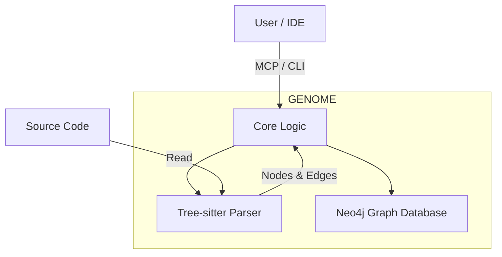

# GENOME Technical Architecture

> [!NOTE]
> This document provides a high-level technical overview of the GENOME system. For specific package details, see the subdirectories.

## System Overview

GENOME is a sidecar knowledge graph that provides code intelligence by analyzing your source code, building a graph of dependencies, and exposing this data via an MCP server or CLI.

## Package Structure

The monorepo is divided into the following strictly scoped packages:

### 1. [CLI](./cli/README.md) (`@genome/cli`)
The command-line interface for interacting with GENOME.
- **Responsibilities**: Command parsing, user feedback, process orchestration.
- **Key Commands**: `scan`, `status`, `impact`, `init`.

### 2. [Core](./core/README.md) (`@genome/core`)
Shared infrastructure and types.
- **Responsibilities**: Configuration loading, error handling, logging, type definitions (`Node`, `Edge`), Zod schemas.
- **Key Files**: `types/nodes.ts`, `config/index.ts`.

### 3. [Parser](./parser/README.md) (`@genome/parser`)
The intelligence engine that converts source code into graph nodes.
- **Responsibilities**: File discovery, Tree-sitter parsing, extraction of functions/classes/imports.
- **Tech**: Tree-sitter (TypeScript/JavaScript).

### 4. [Graph](./graph/README.md) (`@genome/graph`)
The persistence and query layer.
- **Responsibilities**: Database connection (Neo4j), Cypher query generation, schema management (indexes/constraints), graph algorithms (impact analysis).
- **Tech**: Neo4j Driver (Bolt protocol).

### 5. [MCP Server](./mcp-server/README.md) (`@genome/mcp-server`)
The AI interface.
- **Responsibilities**: Exposing graph capabilities to LLMs via Model Context Protocol.
- **Resources**: `genome://stats`.
- **Tools**: `kb_search`, `kb_impact`.

### 6. [Visualization](./viz/README.md) (`@genome/viz`)
The human interface.
- **Responsibilities**: Interactive graph exploration dashboard.
- **Tech**: React, Cytoscape.js.

## Design Principles

1.  **Strict Boundaries**: Packages should not have circular dependencies. Core is the leaf dependency.
2.  **Pipeline Architecture**: Parsing and ingestion are separate steps to allow backpressure handling.
3.  **Observability**: Structured logging (Pino) is used throughout for debugging.
4.  **Error Handling**: Typed errors (`GenomeError`) allow for graceful failure and recovery.
