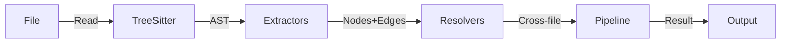

# @nomik/parser

Intelligence engine responsible for converting source code into nodes and edges for the knowledge graph.

## Supported languages

| Language | Grammar | Extensions | Extractors |
|---|---|---|---|
| TypeScript | `tree-sitter-typescript` | `.ts`, `.tsx` | functions, classes, imports, exports, routes, calls, API calls, DB ops |
| JavaScript | `tree-sitter-typescript` | `.js`, `.jsx`, `.mjs`, `.cjs` | functions, classes, imports, exports, routes, calls, API calls, DB ops |
| Python | `tree-sitter-python` | `.py`, `.pyw` | functions, classes, imports, calls |
| Rust | `tree-sitter-rust` | `.rs` | functions, structs/enums/traits, use, calls |
| Markdown | Custom parser (regex) | `.md` | sections (h1-h6 headings, truncated content) |

Tree-sitter grammars are loaded on demand via `src/languages/registry.ts`.

## Architecture



### Module structure

```
src/
├── parser.ts              # Orchestrator (481 lines)
├── extractors/            # AST → nodes/edges per file
│   ├── functions.ts       # FunctionNode extraction
│   ├── classes.ts         # ClassNode extraction
│   ├── imports.ts         # ImportInfo extraction
│   ├── exports.ts         # ExportInfo extraction
│   ├── routes.ts          # RouteNode extraction
│   ├── calls.ts           # CallInfo extraction
│   ├── api-calls.ts       # External API call detection (dynamic, import-aware)
│   ├── db-operations.ts   # Database operation detection (dynamic, import-aware)
│   ├── redis.ts           # Redis operation detection (ioredis, @redis/client, @upstash/redis)
│   ├── queue.ts           # Job queue detection (Bull/BullMQ/Bee-Queue/Agenda/pg-boss)
│   ├── metrics.ts         # Prometheus metrics detection (prom-client, OpenTelemetry)
│   ├── env-vars.ts        # Environment variable detection (process.env, Python os.environ)
│   ├── events.ts          # Event/message bus detection (emit/on/subscribe + Socket.io rooms)
│   ├── tracing.ts         # OpenTelemetry span detection (@opentelemetry/api, dd-trace)
│   ├── messaging.ts       # Message broker detection (KafkaJS, amqplib, NATS, SQS/SNS)
│   ├── swagger.ts         # Swagger/OpenAPI setup detection (NestJS, express, fastify)
│   ├── infra-config.ts    # Prometheus/Grafana config parsing (alerts, dashboards)
│   ├── python.ts          # Python extractor
│   ├── rust.ts            # Rust extractor
│   ├── markdown.ts        # Markdown parser
│   └── index.ts
├── resolvers/             # Cross-file edge resolution (extracted from parser.ts)
│   ├── cross-file.ts      # Cross-file CALLS, DEPENDS_ON
│   ├── intra-file.ts      # Intra-file CALLS, variable aliases
│   ├── route-handling.ts  # HANDLES, EXTENDS, IMPLEMENTS, framework entries
│   └── index.ts
├── config/                # Build tooling configuration
│   ├── tsconfig-resolver.ts  # tsconfig/jsconfig path alias resolution
│   └── index.ts
├── languages/             # Tree-sitter grammar loading
├── discovery.ts           # File discovery (glob)
└── utils.ts               # Hash, node ID generation
```

## Extractors

### TypeScript / JavaScript (`src/extractors/`)

| Extractor | File | Produces |
|---|---|---|
| Functions | `functions.ts` | `FunctionNode` (params, returnType, async, decorators) |
| Classes | `classes.ts` | `ClassNode` (extends, implements, methods, properties) |
| Imports | `imports.ts` | `ImportInfo` (source, specifiers, isDynamic) |
| Exports | `exports.ts` | `ExportInfo` (name, isDefault) |
| Routes | `routes.ts` | `RouteNode` (method, path, handler, middleware) |
| Calls | `calls.ts` | `CallInfo` (callerName, calleeName, line, column) — supports `obj.method()` member expressions, anonymous callbacks (`__file__`), callback arguments (`arr.map(fn)`), shorthand property references (`{ someFunc }`) |
| API Calls | `api-calls.ts` | `APICallInfo` — **dynamic, import-aware** detection of HTTP clients (axios, ky, got, fetch, etc.) + URL heuristic for any `x.get('/api/...')` pattern. Creates `ExternalAPINode` + `CALLS_EXTERNAL` edges |
| DB Operations | `db-operations.ts` | `DBOperationInfo` — **dynamic, import-aware** detection of Prisma, Supabase, Knex patterns. Receiver names resolved from imports (`@prisma/client`, `@supabase/supabase-js`, `knex`). **Chain-aware classification**: `.from().insert().select()` correctly classified as INSERT (walks chain inside-out, write ops take priority). Creates `DBTableNode` + `READS_FROM`/`WRITES_TO` edges |
| Redis | `redis.ts` | `RedisOpInfo` — **dynamic, import-aware** detection of `redis`/`ioredis`/`@redis/client`/`@upstash/redis`. Detects get/set/del/hget/lpush/etc. Includes `resolveRedisInstances()` for `const client = new Redis()` patterns. Creates `DBTableNode` (schema=redis) + `READS_FROM`/`WRITES_TO` edges |
| Queue Jobs | `queue.ts` | `QueueOpInfo` — **dynamic, import-aware** detection of `bull`/`bullmq`/`bee-queue`/`agenda`/`pg-boss`. Tracks `queue.add()` (producer), `queue.process()`/`new Worker()` (consumer). Creates `QueueJobNode` + `PRODUCES_JOB`/`CONSUMES_JOB` edges |
| Metrics | `metrics.ts` | `MetricInfo` + `MetricUsageInfo` — **dynamic, import-aware** detection of `prom-client`/`@opentelemetry/api`. Tracks `new Counter/Gauge/Histogram/Summary()` definitions and `.inc()`/`.observe()`/`.startTimer()` usages (including chained `.labels().inc()`). Creates `MetricNode` + `USES_METRIC` edges |
| Env Vars | `env-vars.ts` | `EnvVarInfo` — `process.env.VAR` (member+subscript), `??`/`\|\|` default detection, `!` required detection, Python `os.environ`/`os.getenv`. Creates `EnvVarNode` + `USES_ENV` edges |
| Events | `events.ts` | `EventInfo` — `emitter.emit()`/`.on()`/`.once()`/`.subscribe()` detection, Python `socketio`/Django signals. **Socket.io enhanced**: room/namespace detection (`socket.to('room').emit()`, `io.of('/ns')`, `socket.join()`). Creates `EventNode` + `EMITS`/`LISTENS_TO` edges |
| Tracing | `tracing.ts` | `SpanInfo` — **dynamic, import-aware** detection of `@opentelemetry/api`/`dd-trace`/`@sentry/node`. Tracks `tracer.startSpan()`/`startActiveSpan()` with tracer variable resolution (`trace.getTracer()` → variable). Creates `SpanNode` + `STARTS_SPAN` edges |
| Messaging | `messaging.ts` | `MessageOpInfo` — **dynamic, import-aware** detection of `kafkajs`/`amqplib`/`nats`/`@aws-sdk/client-sqs`/`@aws-sdk/client-sns`/`@google-cloud/pubsub`. Tracks `producer.send({topic})`, `consumer.subscribe({topic})`, AWS `SendMessageCommand`. **Two-pass variable resolution** for `new Kafka()` → `kafka.producer()` chains. Creates `TopicNode` + `PRODUCES_MESSAGE`/`CONSUMES_MESSAGE` edges |
| Swagger Setup | `swagger.ts` | `SwaggerSetupInfo` — detects `SwaggerModule.setup()`/`createDocument()` (NestJS), `swagger-ui-express`, `@fastify/swagger` register, `swagger-jsdoc`. Enriches routes in swagger-enabled files |
| Infra Config | `infra-config.ts` | `AlertRuleInfo` + `GrafanaPanelInfo` + `ScrapeConfigInfo` — parses Prometheus alert rules (PromQL metric extraction), Grafana dashboard JSON (panel titles + targets), `prometheus.yml` scrape configs. Creates `MetricNode` stubs for referenced metrics |

### Python (`src/extractors/python.ts`)

Extracts: functions (with typed parameters, without self/cls), classes (with inheritance), imports (`import` and `from...import`), function calls.

### Rust (`src/extractors/rust.ts`)

Extracts: functions (`fn`, `pub fn`, `async fn`), structs (fields), enums (variants), traits (as abstract classes), `use` declarations, function calls.

### Markdown (`src/extractors/markdown.ts`)

Extracts: sections (h1-h6 headings), content truncated to 500 characters per section. Each section becomes a `FunctionNode` contained in a `FileNode`.

## Resolvers (`src/resolvers/`)

Cross-file resolution logic, extracted from `parser.ts` for modularity:

| Resolver | File | Responsibility |
|---|---|---|
| Cross-file CALLS | `cross-file.ts` | Multi-map resolution, name collision defense (local shadow + importedFileIds filter), method call scoping |
| Intra-file CALLS | `intra-file.ts` | Local function calls, variable array aliases, declaration aliases |
| Route handling | `route-handling.ts` | HANDLES edges, EXTENDS/IMPLEMENTS, framework entry points (Next.js, Nuxt) |

## Config (`src/config/`)

| Module | File | Responsibility |
|---|---|---|
| tsconfig resolver | `tsconfig-resolver.ts` | Finds tsconfig.json/jsconfig.json, resolves path aliases (`@/*`, `~/*`), supports monorepos with multiple configs. Uses `jsonc-parser` for robust JSONC parsing |

## Produced types

- `FileNode`: id, path, language, hash, **size** (bytes), **lineCount** (actual line count), lastParsed
- `FunctionNode`: id, name, filePath, startLine, endLine, params (`ParameterInfo[]`), returnType, isAsync, isExported, isGenerator, decorators, confidence, **bodyHash?** (SHA-256 whitespace-normalized, 16-char hex)
- `ClassNode`: id, name, filePath, startLine, endLine, isExported, isAbstract, superClass, interfaces, decorators, methods, properties, **bodyHash?** (SHA-256 whitespace-normalized, 16-char hex)
- `ImportInfo`: source, specifiers, isDefault, isDynamic, isTypeOnly, line
- `CallInfo`: callerName, calleeName, line, column, isMethodCall, isConstructor
- `RouteNode`: id, method, path, **handlerName** (resolved from identifier, member_expression, variable_declarator, or call_expression), filePath, middleware, **apiTags?**, **apiSummary?**, **apiDescription?**, **apiResponseStatus?** (Swagger/OpenAPI decorator enrichment)
- `APICallInfo`: callerName, receiverName, method (HTTP verb), endpoint, line
- `DBOperationInfo`: callerName, tableName, operation (SELECT/INSERT/UPDATE/DELETE), receiverName, line
- `RedisOpInfo`: callerName, command, keyPattern, operation, line
- `QueueOpInfo`: callerName, queueName, jobName, kind (producer/consumer), line
- `MetricInfo`: metricName, metricType (counter/gauge/histogram/summary), help, variableName, line
- `MetricUsageInfo`: variableName, operation (inc/dec/set/observe/startTimer), callerName, line
- `QueueJobNode`: id, name, queueName, filePath, jobKind (producer/consumer)
- `MetricNode`: id, name, metricType, help, filePath
- `EventNode`: id, name, eventKind (emit/listen), filePath, **namespace?**, **room?**
- `SpanNode`: id, name, spanKind? (server/client/producer/consumer/internal), attributes?[], filePath
- `TopicNode`: id, name, broker (kafka/rabbitmq/nats/sqs/sns/pubsub), topicKind (producer/consumer), filePath
- `SpanInfo`: callerName, spanName, spanKind?, line
- `MessageOpInfo`: callerName, topicName, broker, kind (producer/consumer), line
- `SwaggerSetupInfo`: kind (setup/spec_file/validator), path?, specFile?, callerName, line
- `AlertRuleInfo`: alertName, expr, severity?, metricNames[], line
- `GrafanaPanelInfo`: panelTitle, metricNames[], datasource?

## Cross-file resolution (`src/parser.ts` + `src/resolvers/`)

The parser resolves cross-file CALLS edges using a multi-map approach (`Map<string, string[]>`) to handle duplicate function names across files. Special handling:
- **`__file__` caller**: anonymous callbacks (e.g., CLI `.action(async () => {...})`) use `__file__` as caller, resolved to `File → Function` CALLS edges
- **Multi-map resolution**: functions with the same name in different files are all candidates for cross-file call targets
- **Name collision defense**: local shadow check (skip global fallback if local function exists) + importedFileIds filter (constrain to files actually imported)
- **Method call scoping**: `obj.method()` calls skip shadow check (receiver disambiguates), filtered by `filterMethodCandidatesByReceiverImport`
- **`OBJ_NOISE` filter**: standard library calls (`path.resolve`, `fs.readFileSync`, etc.) are excluded from CALLS edges

## Discovery (`src/discovery.ts`)

Discovers supported files in a directory via `glob`, respects include/exclude patterns from configuration. Hard-excludes `node_modules`, `dist`, `__pycache__`, `target/`, `.venv/` via regex.

## Tests

**216 tests across 18 files** (parser: 142 tests in 11 files)

- `parser-integration.test.ts`: **33 tests** (cross-file calls, alias imports, name collisions, controller→service delegation, namespace imports, dynamic imports, **lineCount**, **Supabase chain classification**, **route handler names**, **bodyHash uniqueness**, **Redis operations**, **Bull/BullMQ queues**, **Prometheus metrics**, **Socket.io rooms**, **OpenTelemetry spans**, **KafkaJS broker**, **Swagger setup**)
- `api-calls.test.ts`: 17 tests (fetch, $fetch, axios.get/post, URL heuristic, unknown receiver, buildHttpClientIdentifiers, buildAPINodesAndEdges)
- `db-operations.test.ts`: 24 tests (Prisma CRUD, Supabase .from(), Knex fn(), structural match, buildDBClientIdentifiers, buildDBNodesAndEdges)
- `db-schema.test.ts`: 9 tests (SQL, C# EF, Django, Alembic migration schema extraction)
- `env-vars.test.ts`: 9 tests (process.env, Python os.environ, defaults, required)
- `events.test.ts`: 7 tests (emit, on, once, subscribe, Python signals)
- `python.test.ts`: 8 tests (functions, classes, imports, calls)
- `rust.test.ts`: 8 tests (functions, structs, enums, traits, imports, calls)
- `markdown.test.ts`: 7 tests (sections, edges, empty file, levels)
- `discovery.test.ts`: 6 tests (glob, exclusions, markdown)
- `utils.test.ts`: 12 tests (hash, node ID, bodyHash normalization + determinism)
