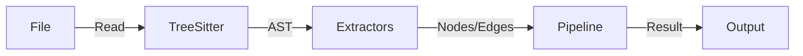

# @genome/parser

The intelligence engine responsible for converting source code into a semantic knowledge graph.

## Architecture

## Extractors (`src/extractors/`)
Each extractor handles a specific aspect of the code:

- **`functions.ts`**: Extracts function declarations, methods, arrows, parameters, and return types.
- **`classes.ts`**: Extracts classes, inheritance (`extends`), interfaces (`implements`), properties, and decorators.
- **`imports.ts`**: Resolves static and dynamic imports to build dependency edges (`IMPORTS`).
- **`exports.ts`**: Tracks exposed symbols.
- **`routes.ts`**: specialized extractor for Express.js and NestJS-style routes (`@Get`, `app.post`).

## Language Support
Currently supports:
- **TypeScript** (`.ts`, `.tsx`)
- **JavaScript** (`.js`, `.jsx`, `.mjs`, `.cjs`)

Uses `tree-sitter` native bindings. Languages are lazy-loaded via `src/languages/registry.ts`.
