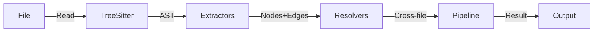

# @nomik/parser

Intelligence engine responsible for converting source code into nodes and edges for the knowledge graph.

## Supported languages

| Language | Grammar | Extensions | Extractors |
|---|---|---|---|
| TypeScript | `tree-sitter-typescript` | `.ts`, `.tsx` | functions, classes, imports, exports, routes, calls, API calls, DB ops |
| JavaScript | `tree-sitter-typescript` | `.js`, `.jsx`, `.mjs`, `.cjs` | functions, classes, imports, exports, routes, calls, API calls, DB ops |
| Python | `tree-sitter-python` | `.py`, `.pyw` | functions, classes, imports, calls |
| Rust | `tree-sitter-rust` | `.rs` | functions, structs/enums/traits, use, calls |
| Markdown | Custom parser (regex) | `.md` | sections (h1-h6 headings, truncated content) |

Tree-sitter grammars are loaded on demand via `src/languages/registry.ts`.

## Architecture



### Module structure

```
src/
├── parser.ts              # Orchestrator (481 lines)
├── extractors/            # AST → nodes/edges per file
│   ├── functions.ts       # FunctionNode extraction
│   ├── classes.ts         # ClassNode extraction
│   ├── imports.ts         # ImportInfo extraction
│   ├── exports.ts         # ExportInfo extraction
│   ├── routes.ts          # RouteNode extraction
│   ├── calls.ts           # CallInfo extraction
│   ├── api-calls.ts       # External API call detection (dynamic, import-aware)
│   ├── db-operations.ts   # Database operation detection (dynamic, import-aware)
│   ├── python.ts          # Python extractor
│   ├── rust.ts            # Rust extractor
│   ├── markdown.ts        # Markdown parser
│   └── index.ts
├── resolvers/             # Cross-file edge resolution (extracted from parser.ts)
│   ├── cross-file.ts      # Cross-file CALLS, DEPENDS_ON
│   ├── intra-file.ts      # Intra-file CALLS, variable aliases
│   ├── route-handling.ts  # HANDLES, EXTENDS, IMPLEMENTS, framework entries
│   └── index.ts
├── config/                # Build tooling configuration
│   ├── tsconfig-resolver.ts  # tsconfig/jsconfig path alias resolution
│   └── index.ts
├── languages/             # Tree-sitter grammar loading
├── discovery.ts           # File discovery (glob)
└── utils.ts               # Hash, node ID generation
```

## Extractors

### TypeScript / JavaScript (`src/extractors/`)

| Extractor | File | Produces |
|---|---|---|
| Functions | `functions.ts` | `FunctionNode` (params, returnType, async, decorators) |
| Classes | `classes.ts` | `ClassNode` (extends, implements, methods, properties) |
| Imports | `imports.ts` | `ImportInfo` (source, specifiers, isDynamic) |
| Exports | `exports.ts` | `ExportInfo` (name, isDefault) |
| Routes | `routes.ts` | `RouteNode` (method, path, handler, middleware) |
| Calls | `calls.ts` | `CallInfo` (callerName, calleeName, line, column) — supports `obj.method()` member expressions, anonymous callbacks (`__file__`), callback arguments (`arr.map(fn)`), shorthand property references (`{ someFunc }`) |
| API Calls | `api-calls.ts` | `APICallInfo` — **dynamic, import-aware** detection of HTTP clients (axios, ky, got, fetch, etc.) + URL heuristic for any `x.get('/api/...')` pattern. Creates `ExternalAPINode` + `CALLS_EXTERNAL` edges |
| DB Operations | `db-operations.ts` | `DBOperationInfo` — **dynamic, import-aware** detection of Prisma, Supabase, Knex patterns. Receiver names resolved from imports (`@prisma/client`, `@supabase/supabase-js`, `knex`). Creates `DBTableNode` + `READS_FROM`/`WRITES_TO` edges |

### Python (`src/extractors/python.ts`)

Extracts: functions (with typed parameters, without self/cls), classes (with inheritance), imports (`import` and `from...import`), function calls.

### Rust (`src/extractors/rust.ts`)

Extracts: functions (`fn`, `pub fn`, `async fn`), structs (fields), enums (variants), traits (as abstract classes), `use` declarations, function calls.

### Markdown (`src/extractors/markdown.ts`)

Extracts: sections (h1-h6 headings), content truncated to 500 characters per section. Each section becomes a `FunctionNode` contained in a `FileNode`.

## Resolvers (`src/resolvers/`)

Cross-file resolution logic, extracted from `parser.ts` for modularity:

| Resolver | File | Responsibility |
|---|---|---|
| Cross-file CALLS | `cross-file.ts` | Multi-map resolution, name collision defense (local shadow + importedFileIds filter), method call scoping |
| Intra-file CALLS | `intra-file.ts` | Local function calls, variable array aliases, declaration aliases |
| Route handling | `route-handling.ts` | HANDLES edges, EXTENDS/IMPLEMENTS, framework entry points (Next.js, Nuxt) |

## Config (`src/config/`)

| Module | File | Responsibility |
|---|---|---|
| tsconfig resolver | `tsconfig-resolver.ts` | Finds tsconfig.json/jsconfig.json, resolves path aliases (`@/*`, `~/*`), supports monorepos with multiple configs. Uses `jsonc-parser` for robust JSONC parsing |

## Produced types

- `FunctionNode`: id, name, filePath, startLine, endLine, params (`ParameterInfo[]`), returnType, isAsync, isExported, isGenerator, decorators, confidence, **bodyHash?** (SHA-256 whitespace-normalized, 16-char hex)
- `ClassNode`: id, name, filePath, startLine, endLine, isExported, isAbstract, superClass, interfaces, decorators, methods, properties, **bodyHash?** (SHA-256 whitespace-normalized, 16-char hex)
- `ImportInfo`: source, specifiers, isDefault, isDynamic, isTypeOnly, line
- `CallInfo`: callerName, calleeName, line, column, isMethodCall, isConstructor
- `RouteNode`: id, method, path, handlerName, filePath, middleware
- `APICallInfo`: callerName, receiverName, method (HTTP verb), endpoint, line
- `DBOperationInfo`: callerName, tableName, operation (SELECT/INSERT/UPDATE/DELETE), receiverName, line

## Cross-file resolution (`src/parser.ts` + `src/resolvers/`)

The parser resolves cross-file CALLS edges using a multi-map approach (`Map<string, string[]>`) to handle duplicate function names across files. Special handling:
- **`__file__` caller**: anonymous callbacks (e.g., CLI `.action(async () => {...})`) use `__file__` as caller, resolved to `File → Function` CALLS edges
- **Multi-map resolution**: functions with the same name in different files are all candidates for cross-file call targets
- **Name collision defense**: local shadow check (skip global fallback if local function exists) + importedFileIds filter (constrain to files actually imported)
- **Method call scoping**: `obj.method()` calls skip shadow check (receiver disambiguates), filtered by `filterMethodCandidatesByReceiverImport`
- **`OBJ_NOISE` filter**: standard library calls (`path.resolve`, `fs.readFileSync`, etc.) are excluded from CALLS edges

## Discovery (`src/discovery.ts`)

Discovers supported files in a directory via `glob`, respects include/exclude patterns from configuration. Hard-excludes `node_modules`, `dist`, `__pycache__`, `target/`, `.venv/` via regex.

## Tests

**137 tests across 13 files** (parser: 87 tests in 8 files)

- `parser-integration.test.ts`: 16 tests (cross-file calls, alias imports, name collisions, controller→service delegation, namespace imports, dynamic imports)
- `api-calls.test.ts`: 17 tests (fetch, $fetch, axios.get/post, URL heuristic, unknown receiver, buildHttpClientIdentifiers, buildAPINodesAndEdges)
- `db-operations.test.ts`: 21 tests (Prisma CRUD, Supabase .from(), Knex fn(), structural match, buildDBClientIdentifiers, buildDBNodesAndEdges)
- `python.test.ts`: 8 tests (functions, classes, imports, calls)
- `rust.test.ts`: 8 tests (functions, structs, enums, traits, imports, calls)
- `markdown.test.ts`: 7 tests (sections, edges, empty file, levels)
- `discovery.test.ts`: 6 tests (glob, exclusions, markdown)
- `utils.test.ts`: 12 tests (hash, node ID, bodyHash normalization + determinism)
